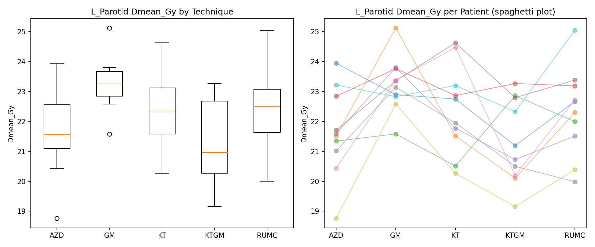

# DVH Analysis Toolkit

**[Try the live demo →](./demo/index.html)** (pick any organ/metric, toggle which techniques to include, and see a live in-browser Friedman test, mean-rank chart, and raw data table — or upload your own tidy CSV to analyze real data, entirely client-side. No install needed.)



A general-purpose statistical toolkit for comparing radiotherapy planning
techniques across patients using dose-volume-histogram (DVH) metrics.
Built out of a real workflow comparing multiple planning techniques for
organ-at-risk sparing (e.g. lenses, lacrimal glands, parotids) in
volumetric arc therapy / hippocampal-avoidance whole-brain radiation
planning.

**No real patient data is included or required.** This repo ships a
synthetic data generator (`generate_synthetic_data.py`) that produces a
dataset with the same shape and structure as a real multi-technique DVH
comparison study, so the whole pipeline is runnable and demonstrable
without any PHI or clinical data ever touching this repo.

## Why this statistical approach

- **Friedman test** (not repeated-measures ANOVA) as the primary test: DVH
  metrics across techniques are a repeated-measures design (the same
  patient is planned under every technique), but dose metrics are often
  not normally distributed, so a non-parametric, rank-based test blocked
  by patient is the more defensible choice.
- **Post-hoc pairwise Wilcoxon signed-rank tests** when the Friedman test
  is significant, to identify *which* technique pairs actually differ.
- **Multiple comparison correction** (both Bonferroni and
  Benjamini-Hochberg are implemented) applied across every pairwise test
  run for a given organ, since testing all `C(k,2)` technique pairs
  without correction inflates the false-positive rate. Bonferroni
  controls family-wise error (conservative); BH controls the false
  discovery rate (usually more powered when many tests are run) --
  both are provided so you can see how the conclusion changes depending
  on which error-control philosophy you use.
- **Variance decomposition** (two-way ANOVA-style, patient effect vs.
  technique effect) to answer a different question than significance
  testing alone: *how much* of the spread in dose comes from
  patient-to-patient anatomical variation vs. the planning technique
  itself. A technique can be statistically significant while still
  explaining a small fraction of total variance.

## Usage

```bash
pip install -r requirements.txt

# Generate a synthetic dataset shaped like a real study
python generate_synthetic_data.py

# Run the full statistical pipeline (Friedman -> variance decomposition -> post-hoc)
python dvh_toolkit.py

# Generate boxplot + per-patient "spaghetti plot" comparison figures
python plot_dvh.py

python -m pytest tests/ -v
```

### Sample output

```
=== Friedman test across techniques, by organ (Dmean_Gy) ===
     Organ   Metric  friedman_stat  p_value  n_patients
 L_Parotid Dmean_Gy          10.80 0.028906          10
     R_Eye Dmean_Gy          20.56 0.000387          10
...

=== Variance decomposition for L_Parotid (Dmean_Gy) ===
   Source        SS  df       MS        F  p_value  pct_variance_explained
  Patient 42.43   9  4.71  4.05  0.0012                   39.7
Technique 22.48   4  5.62  4.83  0.0032                   21.0
 Residual 41.90  36  1.16   NaN     NaN                    39.2
```

Note how the Friedman test can be significant for an organ, and the
variance decomposition shows technique still explains a real share of
variance -- but the pairwise post-hoc comparisons (with correction
applied) may not survive for any single pair. That's a genuine and useful
finding, not a bug: it means techniques differ *as a group* without any
one pair being clearly and individually better after accounting for
multiple testing, in a dataset this size.

## Using this on your own data

Replace `synthetic_dvh_data.csv` with a real tidy long-format CSV with
columns `PatientID, Organ, Technique, <metric columns...>` and every
function in `dvh_toolkit.py` will work unchanged -- `to_4d_array()`
handles the reshape into the patients x organs x techniques structure
automatically from any correctly-shaped long dataframe.

## Extending this

- Add `V_x` (volume receiving at least x Gy) style metrics beyond the
  three included (`Dmean`, `Dmax`, `V20`).
- Add a mixed-effects model option (patient as random effect) as an
  alternative to the ANOVA-style decomposition here, for when you want to
  properly account for unbalanced designs (missing organ contours, etc.)
- QUANTEC-style organ-specific dose constraint checking as an automated
  pass/fail layer on top of the raw metrics.
